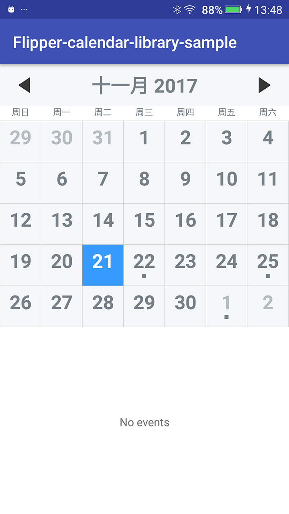

# FlipperCalendar


### Include it in your gradle:

### Usage

### Reference denpendency
This extended library is built based on earlier **[android-times-square](https://github.com/square/android-times-square)** library of eclipse-version, most code has been deeply modified and new features have been added in this library.

## License

```
    Copyright 2015 Ralken Ltd.

    Licensed under the Apache License, Version 2.0 (the "License");
    you may not use this file except in compliance with the License.
    You may obtain a copy of the License at

       http://www.apache.org/licenses/LICENSE-2.0

    Unless required by applicable law or agreed to in writing, software
    distributed under the License is distributed on an "AS IS" BASIS,
    WITHOUT WARRANTIES OR CONDITIONS OF ANY KIND, either express or implied.
    See the License for the specific language governing permissions and
    limitations under the License.
```
